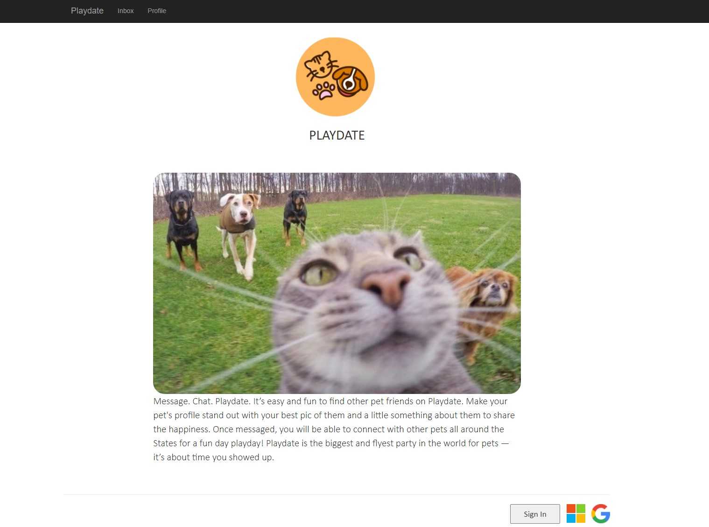
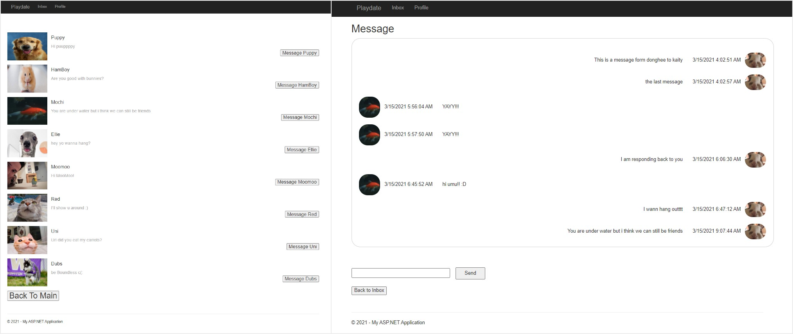

# Playdate (https://playdate4pets.azurewebsites.net/)
  Tinder for pets; A website for pet owners to arrange meet ups for their pets to socialize with others :D   
**NOTE: If you want to look around the website without creating an account, use this test acount!** 
#### ID:  *playdate4tests@gmail.com*  PWD: *playdate1234*

### Welcoming Page

### Main Feed & Profile Page

### Inbox & Direct Message Page

## Cloud Services Utilized
**Azure App Serive** Incorporated Azure SQL DB to save and query previous messages.  Message page now can display old chats between the users. Inbox page now contains all the chat rooms that has been open.

**Azure SQL Databse** Saves and loads previous message histories for each chat room.

**Gmail Notifications** Alerts the user when they receive a message from other users.

**Azure Blob Storage** Saves the profile picutres of the users.

**Azure Table** Logs the user attributes.

**Azure Authentication** Enables sign in/up using Google and Microsoft accounts.

